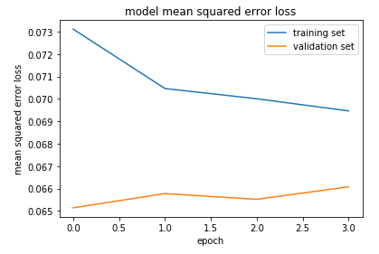
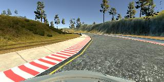
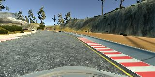
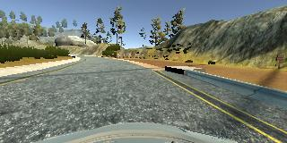
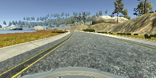
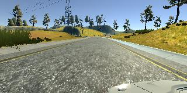
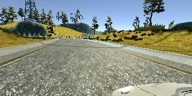
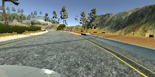
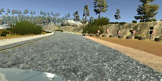

# **Behavioral Cloning** 
---

**Behavioral Cloning Project**

The goals / steps of this project are the following:
* Use the simulator to collect data of good driving behavior
* Build, a convolution neural network in Keras that predicts steering angles from images
* Train and validate the model with a training and validation set
* Test that the model successfully drives around track one without leaving the road
* Summarize the results with a written report

## Rubric Points
Here I will consider the [rubric points](https://review.udacity.com/#!/rubrics/432/view) individually and describe how I addressed each point in my implementation.  

---
### Files Submitted & Code Quality

#### 1. Submission includes all required files and can be used to run the simulator in autonomous mode

My project includes the following files or directories:
- [x] model.py containing the script to create and train the model;
- [x] drive.py for driving the car in autonomous mode;
- [x] model.h5 containing a trained convolution neural network 
- [x] writeup_report.md summarizing the results
- [x] run.mp4 which records the video of simulator autonomous driving.
- [x] img4report, a directory contains the image used in the report.

#### 2. Submission includes functional code
Using the Udacity provided simulator and my drive.py file, the car can be driven autonomously around the track by executing 
```sh
python drive.py model.h5
```

#### 3. Submission code is usable and readable

The model.py file contains the code for training and saving the convolution neural network. The file shows the pipeline I used for training and validating the model, and it contains comments to explain how the code works.

### Model Architecture and Training Strategy

#### 1. An appropriate model architecture has been employed

I used convolutional neural network to implement the solution. The architecture is described in this  paper, [End to End Learning for Self-Driving Cars](http://images.nvidia.com/content/tegra/automotive/images/2016/solutions/pdf/end-to-end-dl-using-px.pdf), and I tailored it to my scenario. My final model architecture are nine layers; details are as follows:

The first layer is a normalization layer, in which the images' RGB value are rescaled to values between [-0.5, 0.5], which helps reducing the calculated loss value in scale;

The second layer is a data preprocessing layer, in which the images collected in the simulator training mode (data collection is explained in below sections) are cropped to a certain range, by which the noisy pixels are deleted. 

Layer 3 to 6 are four convolution layers, as said before, this architecture referenced the paper mentioned before, but considering the fact that the scenario in the simulator is much less complicated than the one in the paper, I simplified the architecture, both in the layers and the parameters. The first two convolution layers uses 5x5 filters to generate a 3 and 24 feature maps respectively, followed by a RELU to introduce nonlinearity, and a Max pooling. The last two convolution layers uses 3x3 filters to generate 36 and 16 feature maps respectively, again followed by a RELU and a Max pooling. 

After the convolution layers, three fully connected layers follow, which uses 120, 84 and 1 neuros. The one neuro in the last layer gives prediction of the steer angle. 

A picture is given in below to show the architecture. 

#### 2. Attempts to reduce overfitting in the model

Altogether I collected more than 30,000 images, among them 13247 images were finally used, these images contains a large portion of recovering ones, which is purposely driving snake-like to the left and right most then steer back to the center lane. I used Dropout after the convolution output with a ratio of 0.25. The models were planned to train 20 epochs, but early stopping occurs at the third epochs; the generated models were tested by the simulator, and could drive autonomously in track1. 



#### 3. Model parameter tuning

The model used an adam optimizer, so the learning rate was not tuned manually.

But I did introduce a hyper parameter which is the corrected steer angle of left and right camera images, I tried various values, range from 0.04 to 0.1, applied to the left and right images equally or differently, and finally found that the 0.04 is the workable value when applied equally on both left and right. 

#### 4. Appropriate training data

The data I collected are solely from track1, with different collection strategy. The data contains:
1. two loops of track1 images with speed about 10, which is 13,000+ images (center, left and right camera)
2. three loops of snaking driving with speed about 10 images, about 13,000+, (center, left and right camera)
3. 5 loops of track1 images in high speed about 30, about 15,000+; 

I tried and compared the results with different data set, but the final result was trained only using the 13,000+ snaking images. 

### Model Architecture and Training Strategy

#### 1. Solution Design Approach

As I was new to Keras, my first step was to verify I can "drive" Keras, since the CNN is more like a black box and debugging is difficult, I didn't want to use the tool wrongly. I thought this step was essential. 

I first implemented a LeNet5 model using Keras and applied it to the MNIST dataset. The result is quite good and which gives me confidence that my knowledge in Keras is OK when applies to new model and new problem.

The next step is choosing the model architecture. The Nvidia paper mentioned in the lecture, is specific to the vehicle driving domain, I believe it would be very relevant to using this model, but considering the fact that the images generated from simulator were much less complicated than the ones used in this paper, I simplified the architecture, details are explained be previous sections.

Once the model was defined, I started the training. I split my image and steering angle data into a training and validation set with a ratio of 8:2. Because the memory could not hold all the training data, I had to use python generators to feed the data in batches. Also because I wanted to adopt an incremental way of adding driving samples, I designed the data feeding function in such a way that the training data can be dynamically loaded. details are explained in the code. 

The training process were relatively straightforward, a trial and error method were used. I trained the model against various data sets, used different training epochs, and tuned the hype-parameter of the left and right steer angles for many times, and finally, got to the current solution which can drive the car around the track without leaving the road. 

#### 2. Final Model Architecture

The final model architecture is explained in previous sections, here is a visualization of the architecture 


#### 3. Creation of the Training Set & Training Process

The image collection strategies are explained before, here are some examples:

The center lane images:


The recovering images:






The left and right camera images:






After the collection process, I had about 13,000+ number of data points. 
The steering angle of the test data set has the following distribution:


I finally randomly shuffled the data set and put 20% of the data into a validation set. 


